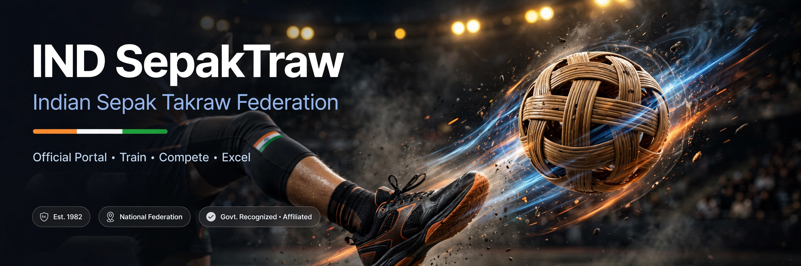
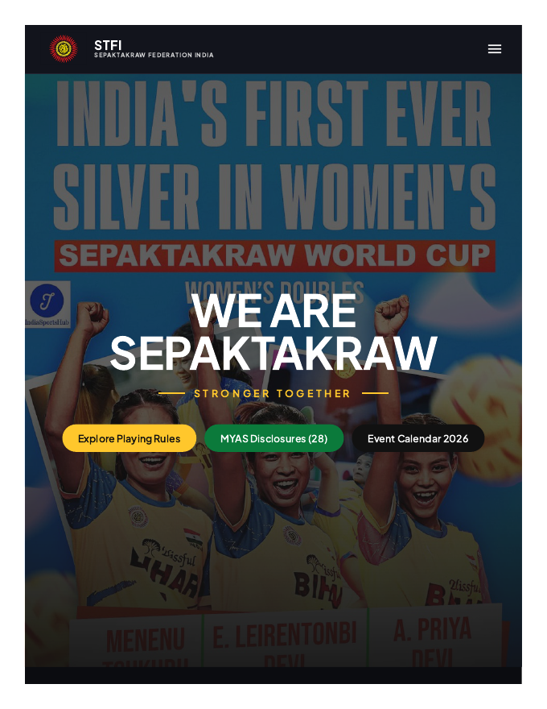

# IND-SepakTraw

> ## Status: 🟢 Completed
>
> <progress value="90" max="100"></progress>
> **Progress: 90%** — Full portal with admin panel; production build verified.

<p align="center">
  
</p>


## Screenshots

<p align="center">
  
  <br />
  <em>IND Sepak Takraw portal — hero, game guide, match simulator.</em>
</p>


## What it is

A dark-themed web portal for Indian Sepak Takraw (the STFI — Sepak Takraw Federation of India). It presents the sport with an editorial hero, event countdown, stats strips, moments showcase, category and product grids, and sponsor strips — plus dedicated pages for MYAS compliance, championship events, rules & regulations, notices/news, and contact. A built-in admin panel lets editors manage site content without touching code.

## What works (verified)

- ✅ Production build — `npm install` + `vite build` completed with exit 0 (verified on this machine)
- ✅ Editorial hero + event countdown + stats strip on the home page — `features/hero/`, `features/moments/`
- ✅ Category grid, product grid, sponsors strip — `features/categories/`, `features/products/`
- ✅ Dedicated pages — MYAS compliance, championship events, rules & regulations, notice/news, contact — `features/pages/`
- ✅ Hash-based view routing — `#myas`, `#events`, `#contact`, `#rules`, `#notice` — `App.jsx`
- ✅ Admin panel — 400-line content management UI — `admin/AdminPanel.jsx`
- ✅ Content context with editable defaults — `content/ContentContext.jsx`, `content/defaults.js`

## Tech stack

| Layer | Tech |
|---|---|
| Framework | React 18 + React Router 7 |
| Build | Vite 6 |
| UI | MUI 9, Emotion, Lucide icons |
| Styling | Dark editorial theme (`#0b0c10` base) |

## How to run

```bash
npm install
npm run dev      # dev server with hot reload
npm run build    # production build → dist/
npm run preview  # preview the production build
```

> Verified: `npm install` (133 packages) and `npm run build` both succeed.

## Screenshots

No screenshots ship with the repo. The banner above is the visual; run `npm run dev` to see the portal.

## What you can add more

- [ ] Real backend for the admin panel — content edits currently live in the client
- [ ] Live event data — countdown and results are static content today
- [ ] Player/athlete profiles — the sport's stars deserve pages
- [ ] Photo galleries from actual tournaments — replace stock moments
- [ ] Hindi language toggle — the audience is Indian; i18n would widen reach
- [ ] SEO meta + sitemap — currently a client-rendered SPA

## Project structure

```
IND-SepakTraw/
├── src/
│   ├── App.jsx                 # View router (hash-based)
│   ├── admin/AdminPanel.jsx    # Content management UI
│   ├── content/                # ContentContext + editable defaults
│   ├── features/
│   │   ├── navigation/         # TopNav
│   │   ├── hero/               # EditorialHero
│   │   ├── moments/            # Countdown, stats, showcase, sponsors
│   │   ├── categories/         # CategoryGrid
│   │   ├── products/           # ProductGrid
│   │   ├── pages/              # MYAS, events, rules, news, contact
│   │   └── footer/             # FooterGrid
│   └── components/ui/          # Buttons, images, motion helpers, logos
├── index.html
├── vite.config.js
└── package.json
```

---
*README written after code audit on 2026-10-08.*
